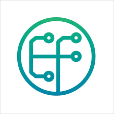

<div align="center">


<p>
  <strong>Estudante da Escola do Futuro de Goiás · Fundador da heisuscode</strong><br>
  <em>Construindo sistemas eficientes que resolvem problemas reais.</em>
</p>

<p>
  <a href="mailto:heitorcf10@gmail.com"></a>
  <a href="https://linkedin.com/in/heitorcarvalhoferreira"></a>
  <a href="https://wa.me/5561994613752"></a>
  <a href="https://heisuscode.dev"></a>
</p>

<p>
  
  
</p>

</div>


## 👨‍💻 Sobre

Olá! Meu nome é **Heitor Carvalho Ferreira**. Sou participante do programa **Jornada para o Futuro**, cursando Desenvolvimento Web, Cibersegurança e Ciência de Dados, e fundador da **heisuscode**.

Realizei um intercâmbio acadêmico na Inglaterra, na **University of Sussex**, com certificação de **inglês intermediário**, e atualmente busco minha primeira oportunidade na área de tecnologia.

```yaml
foco:      [ sistemas reais, ciência de dados, IA aplicada, segurança digital ]
atuação:   [ frontend, back-end & APIs, análise de dados, automação ]
dados:     [ Python, Pandas, SQL, visualização e dashboards ]
objetivo:  primeira oportunidade em tecnologia
```

<br clear="all"/>


## 🧭 Áreas de atuação

| Área | O que eu faço |
| :--- | :--- |
| 🌐 **Desenvolvimento Web** | Sistemas web completos, do frontend à API |
| 📊 **Ciência de Dados** | Coleta, limpeza e tratamento de bases, análise exploratória e dashboards com Python, Pandas e SQL |
| 🤖 **Inteligência Artificial** | IA aplicada a projetos reais, com apoio de modelos e automação inteligente |
| 🔐 **Cibersegurança** | Segurança digital e boas práticas de desenvolvimento |
| ⚙️ **Automação** | Automação de processos e integração entre sistemas |


## 🧰 Stack

<table width="100%">
  <tr>
    <td width="50%" valign="top" align="center">
      <strong>💻 Principais habilidades</strong><br><br>
      
    </td>
    <td width="50%" valign="top" align="center">
      <strong>🛠️ Ferramentas</strong><br><br>
      
    </td>
  </tr>
</table>

<div align="center">
  <br>
  <strong>📚 Estudando agora</strong>
  <br><br>
  
  
  
  
</div>

<br>


## 🚀 Projetos Desenvolvidos

<table width="100%">
  <tr>
    <td width="50%" valign="top" align="center">
      <h3>🖥️ HeisusCode</h3>
      <p><em>Desenvolvimento Web e Cibersegurança</em></p>
      <p align="left">Soluções web e sistemas sob medida para empresas, do frontend à API, com foco em performance, segurança e presença digital profissional.</p>
      
      
      
    </td>
    <td width="50%" valign="top" align="center">
      <h3>🏥 Sistema de Gestão Hospitalar</h3>
      <p><em>Plataforma Full Stack · TCC em desenvolvimento</em></p>
      <p align="left">Gestão hospitalar com módulo de agendamento de consultas e controle financeiro, voltada à organização de dados clínicos e automação de processos.</p>
      
      
      
    </td>
  </tr>
  <tr>
    <td width="50%" valign="top" align="center">
      <h3>💰 MoneyControl</h3>
      <p><em>Gestão Financeira Pessoal</em></p>
      <p align="left">Aplicação para controle de finanças pessoais, com registro de receitas e despesas e visualização clara dos gastos.</p>
      
      
    </td>
    <td width="50%" valign="top" align="center">
      <h3>🤖 JARVIS</h3>
      <p><em>Assistente de IA Personalizado</em></p>
      <p align="left">Assistente de inteligência artificial próprio, com foco em automação de tarefas e integração de sistemas do dia a dia.</p>
      
      
    </td>
  </tr>
</table>

<div align="center">
  <a href="https://github.com/Ferre1ra10?tab=repositories"></a>
</div>

<br>


### 💼 Experiências

Na visão geral abaixo você encontrará minha trajetória mais recente:

<br>

[](#)
**Intercâmbio Internacional** <br>
[**University of Sussex Brighton**](#)  <br>
Foco: `Imersão Acadêmica`, `Visão Global`, `Inglês Intermediário`, `Tecnologia`<br>
Local: [Inglaterra]()
<br><br><br>

[](#)
**Técnico em Desenvolvimento Web e Cibersegurança** <br>
[**Escola do Futuro de Goiás**](#) • Cursando <br>
Linguagens & Tecnologias: `Desenvolvimento Web`, `Cibersegurança`, `Lógica de Programação`<br>
Projetos em destaque: [HeisusCode]()
<br><br><br>

[](https://www.dio.me/)
**Bootcamp** <br>
[**DIO**](https://www.dio.me/) • Formação <br>
Linguagens & Tecnologias: `TypeScript`, `Node.js`, `JavaScript`, `Inteligência Artificial`<br>
Projetos em destaque: [Certificações no LinkedIn]()
<br><br><br>

[](#)
**Técnico em Ciência de Dados** <br>
[**Escola do Futuro de Goiás**](#) • Cursando <br>
Foco: `Python`, `Pandas`, `SQL`, `Análise e Tratamento de Dados`<br>
Projetos em destaque: [Dashboards e Projetos de Gestão de Dados]()
<br><br><br>


<div align="center">
  <sub>Focado em criar soluções tecnológicas que geram impacto real.</sub>
</div>
